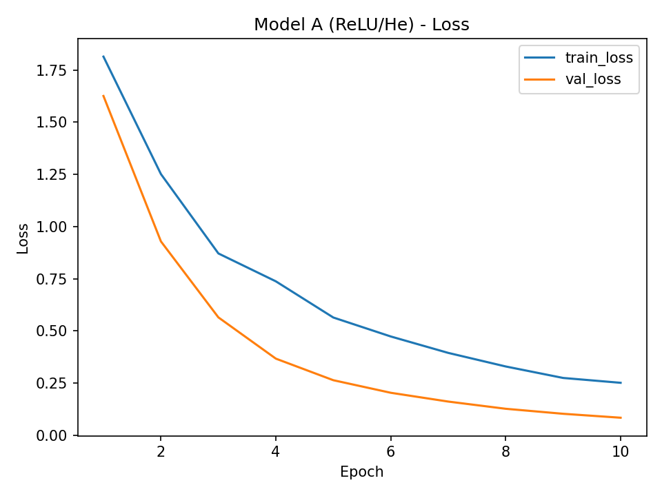
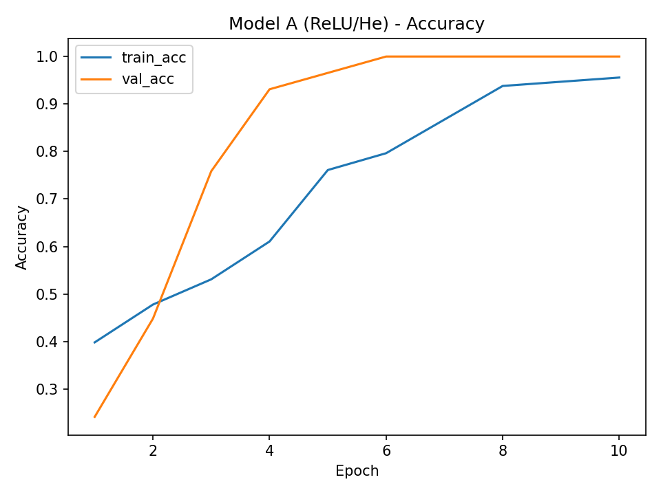
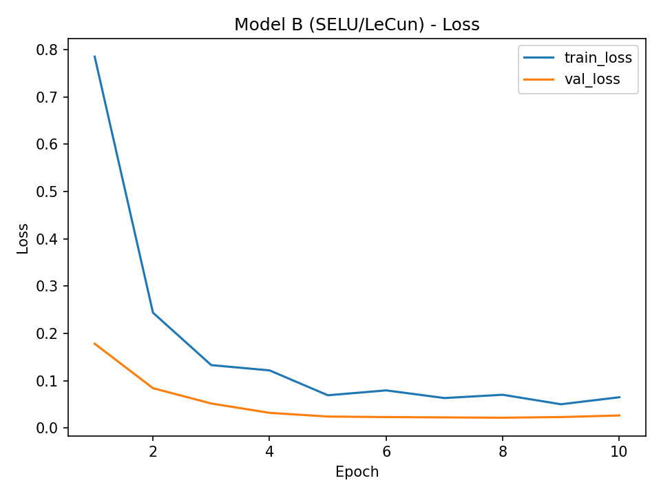
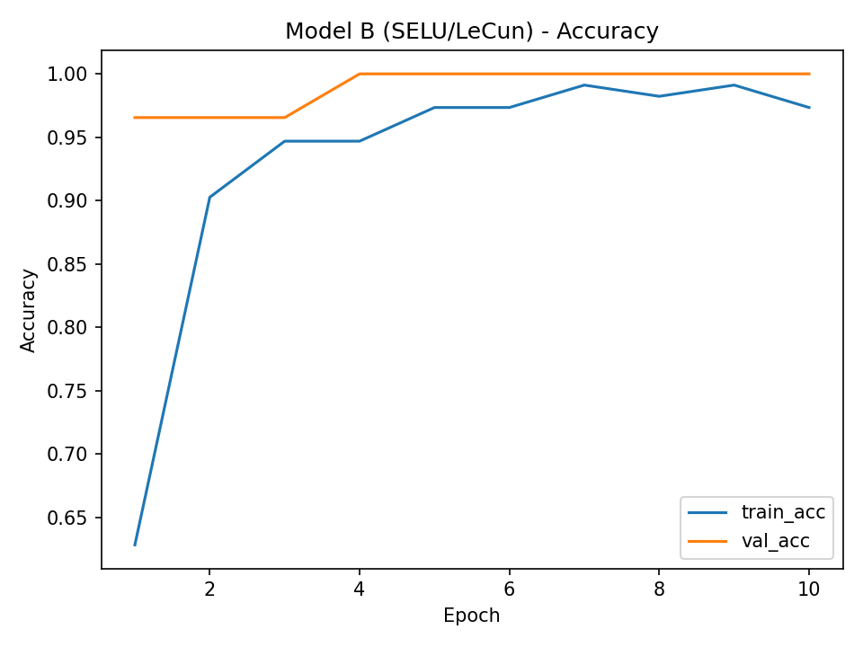

  # LAB3 – Klasyfikacja zbioru Wine (TensorFlow)

  ## Struktura projektu

```bash
LAB3/
├── wine/
│   ├── wine.data
│   ├── wine.names
│
├── main.py          # trening i ewaluacja modeli
├── predict.py       # predykcja CLI (argparse)
├── preparecsv.py    # konwersja do CSV (opcjonalne)
│
├── artifacts/
│   ├── modelA.keras
│   ├── modelB.keras
│   ├── scaler_stats.npz
│   ├── modelA_loss.png
│   ├── modelA_acc.png
│   ├── modelB_loss.png
│   ├── modelB_acc.png
│   └── summary.json
│
└── runs/            # logi TensorBoard
```

---
## Uruchomienie

**Utworzenie środowiska**
```bash
python -m venv .venv
.venv\Scripts\activate       # Windows
pip install tensorflow pandas scikit-learn matplotlib
```

**Konwersja wine.data do CSV**

```bash
python preparecsv.py
```

**Trening dwóch modeli**

```bash
python main.py --csv wine/wine.data --epochs 10 --batch_size 16 --lr 0.001
```

Po treningu:
* Wyniki zapisane w `artifacts/`
* TensorBoard:
```bash
tensorboard --logdir runs
```

**Predykcja z linii komend**

```bash
python predict.py --model artifacts/modelB.keras --scaler artifacts/scaler_stats.npz `
  --Alcohol 13.2 --Malic_acid 1.78 --Ash 2.14 --Alcalinity_of_ash 11.2 --Magnesium 100 `
  --Total_phenols 2.65 --Flavanoids 2.76 --Nonflavanoid_phenols 0.26 --Proanthocyanins 1.28 `
  --Color_intensity 4.38 --Hue 1.05 --"OD280/OD315_of_diluted_wines" 3.4 --Proline 1050
```

Wynik:
```json
{
"Predicted_class": 1,
"Probabilities": [0.9921, 0.0063, 0.0016]
}
```

---

## Krzywe uczenia

**Model A (ReLU/He)**




**Model B (SELU/LeCun)**




---

## Wyniki

Z pliku `summary.json`:

| Parametr                | Wartość                    |
| ----------------------- | -------------------------- |
| Epoki                   | 10                         |
| Batch size              | 16                         |
| Learning rate           | 0.001                      |
| Test accuracy (Model A) | **0.889**                  |
| Test accuracy (Model B) | **0.917**                  |
| Lepszy model            | **Model B (SELU/LeCun)**   |

---

## Wnioski

Oba modele osiągnęły bardzo dobre wyniki – powyżej 88% dokładności, więc dobrze poradziły sobie z klasyfikacją win.

Model B (SELU/LeCun) okazał się trochę lepszy – szybciej się uczył i miał stabilniejsze wyniki przewiduje że to dzięki zastosowaniu funkcji SELU, która sama normalizuje dane w trakcie uczenia się modelu.

Krzywe uczenia na wykresach pokazują, że Model B szybciej osiąga wysoką dokładność i nie widać u niego przeuczenia (val_loss i val_acc są stabilne).

Model A (ReLU/He) też działa poprawnie, ale prawdopodobnie potrzebowałby więcej epok, żeby dojść do podobnych wyników.

Ogólnie oba modele są dobre, jednak Model B daje lepszą jakość przy krótszym treningu.

## Podsumowanie

Projekt pokazuje cały proces tworzenia klasyfikatora od podstaw – od przygotowania danych aż po gotowy model, który można uruchomić z terminala.
Użyłem bibliotek TensorFlow, Pandas i NumPy do przetwarzania danych i budowy sieci, a do wizualizacji wyników – Matplotlib i TensorBoard.

W ramach projektu:

* wczytałem dane o winach i odpowiednio je przetworzyłem,

* zakodowałem klasy w formie one-hot,

* stworzyłem i porównałem dwa modele typu Sequential,

* zapisałem ich wyniki i krzywe uczenia,

* przygotowałem skrypt, który pozwala użytkownikowi wpisać cechy wina i sprawdzić, do której kategorii (1–3) należy.

Dzięki temu projekt można łatwo uruchomić i samemu przetestować — pokazuje on w praktyce, jak działają proste sieci neuronowe w klasyfikacji danych.

---
**Moje skrypty na szybko do testowania**
```bash
python preparecsv.py

python main.py --csv wine/wine.data --epochs 10 --batch_size 16 --lr 0.001

tensorboard --logdir runs

python predict.py --model artifacts/modelB.keras --scaler artifacts/scaler_stats.npz `
  --Alcohol 13.2 --Malic_acid 1.78 --Ash 2.14 --Alcalinity_of_ash 11.2 --Magnesium 100 `
  --Total_phenols 2.65 --Flavanoids 2.76 --Nonflavanoid_phenols 0.26 --Proanthocyanins 1.28 `
  --Color_intensity 4.38 --Hue 1.05 --"OD280/OD315_of_diluted_wines" 3.4 --Proline 1050


type artifacts/summary.json   # Windows
cat artifacts/summary.json    # Linux/Mac
```

